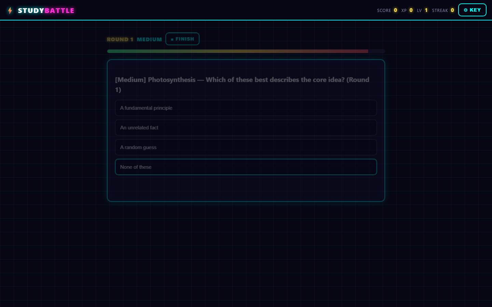
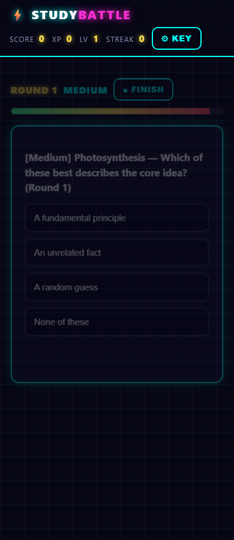

# ⚡ STUDY BATTLE — AI Study Battle Game

Neon-arcade quiz battler (NOT a chatbot). Battle Groq AI (`openai/gpt-oss-120b`) across timed rounds, build streaks/combos, and slay the BOSS every 5th round.

## Features
- Timed multiple-choice + true/false rounds, Boss Round every 5th (3× XP)
- XP, levels, streaks, combo multiplier, adaptive difficulty
- Answer explanations, live score, final results with weak-topic detection
- Copy results, replay, reset

## Requirements
- Python 3.10+
- A free Groq API key ([console.groq.com/keys](https://console.groq.com/keys))
- Internet (AI calls go to Groq)

## Installation
```bash
python -m venv .venv
# Windows: .venv\Scripts\activate | macOS/Linux: source .venv/bin/activate
pip install -r requirements.txt
copy .env.example .env   # add GROQ_API_KEY  (or paste the key in Settings later)
```

## How to play
1. Enter a subject/topic, pick difficulty, press **START BATTLE**
2. Answer before the timer bar empties — streaks build your combo multiplier
3. Watch Boss Rounds, read explanations, check the final screen for weak topics

## Limitations
- Needs a Groq key + internet for questions; single in-memory session (restart clears it)
- Groq free-tier rate limits may need a short wait between games

## Stack
Python + FastAPI + vanilla HTML/CSS/JS · OpenAI SDK → `https://api.groq.com/openai/v1` · Model `openai/gpt-oss-120b`

## Run
```bash
pip install -r requirements.txt
uvicorn app:app --port 8010
# open http://127.0.0.1:8010
```

## API key
Settings ⚙ KEY modal → POSTs key to backend, verified live via `models.list`, stored ONLY in process memory. `DELETE /api/key` clears. `.env` (`GROQ_API_KEY`) fallback. `GET /api/status` returns presence/source only. Frontend never stores keys.

## Game API
- `POST /api/start {topic≤200, difficulty}` → new session
- `POST /api/question` → `{type, question, options, time_limit_ms, is_boss}` (15s MCQ / 10s T/F / 20s boss; boss every 5th, 3× XP)
- `POST /api/answer {choice, time_ms}` → correctness + XP (`base×combo×speed`, combo +0.5 every 3 streak) + adaptation (2 wrong → easier, streak≥5 → harder)
- `POST /api/finish` → score, level, accuracy, weak topics, XP; Replay + Copy results buttons

## Tests
```bash
pip install -r requirements-test.txt
pytest -q
```
9 tests: combo/speed/XP/level/adaptation math, `/api/start` validation, 5-round fallback state machine (boss on round 5), weak-topics, `/api/status` shape.

## Screenshots


